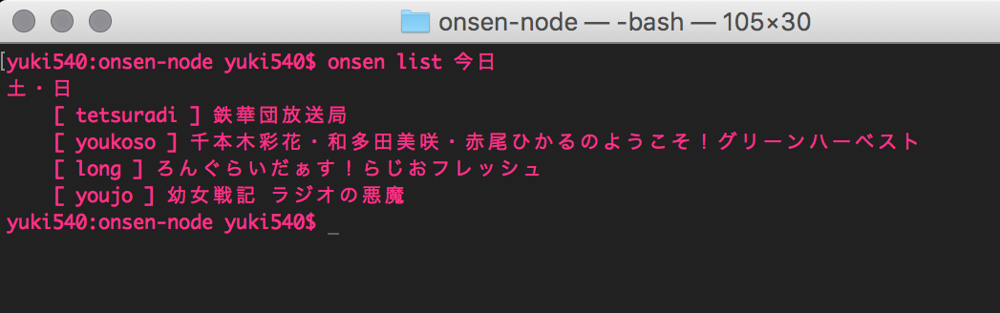
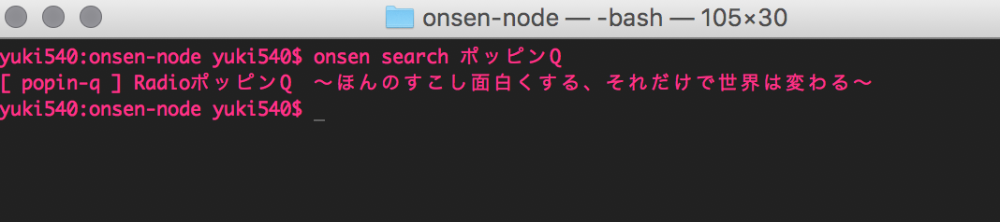
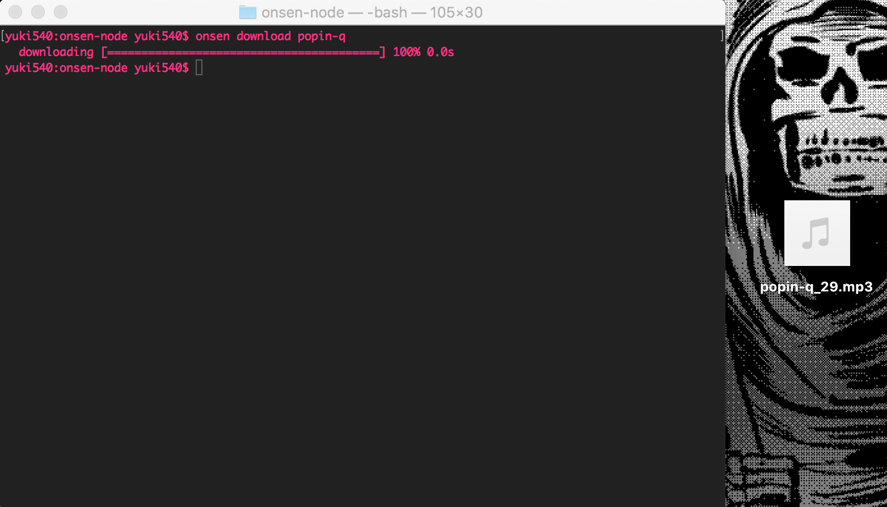
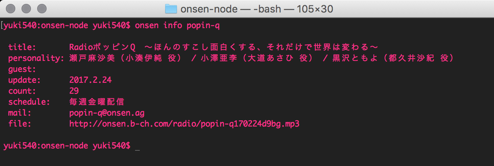

# onsen-node
声優ラジオサイト「音泉」APIモジュール for Node.js

- onsen-nodeについての紹介ページ
  - [Qiita - 声優ラジオサイト「音泉」APIモジュール](http://qiita.com/yuki540/items/a9bcafc0eafbd61d7bb6)
- 開発者
  - yui540
  - [Twitter - @yui540](https://twitter.com/yui540)
  - [HP - magical-girl.site](https://magical-girl.site/)

## Method
- getList
  - 番組一覧（曜日ごと）の取得
- getInfo 
  - 番組情報の取得
- getLink
  - 音声・動画リンクの取得
- search
  - 番組の検索
- getRecommends
  - レコメンドの取得
- getRecommendMovie
  - おすすめの番組の取得
- getRecommendGoods
  - おすすめの商品の取得
- getTopics
  - トピックの取得

## Usage
### npm install
```
npm install onsen-node
```

### example
```coffeescript
onsen = require 'onsen-node'

##
# 番組一覧の取得
##
onsen.getList (list) ->
	if list isnt null
		console.log list

##
# 番組情報の取得
##
onsen.getInfo '番組名', (info) ->
	if info isnt null
		console.log info

##
# 音声・動画リンクの取得
## 
onsen.getLink '番組名', (link) ->
	if link isnt null
		console.log link

##
# 番組の検索
##
onsen.search '検索ワード', (list) ->
	if list isnt null
		console.log list

##
# レコメンドの取得
##
onsen.getRecommends (list) ->
	if list isnt null
		console.log list

##
# おすすめの番組の取得
##
onsen.getRecommendMovie (list) ->
	if list isnt null
		console.log list

##
# おすすめの商品の取得
##
onsen.getRecommendGoods (list) ->
	if list isnt null
		console.log list

##
# おすすめの番組の取得
##
onsen.getRecommendTopics (list) ->
	if list isnt null
		console.log list
```

## CLI
### npm install
```
sudo npm install -g onsen-node
```

### command
ヘルプ
```
onsen -h
```

番組一覧
```
onsen list 
onsen list 今日
onsen list 月
```


番組の検索
```
onsen search 番組名
```


音声・動画ファイルのダウンロード
```
onsen download 番組名
```


番組情報
```
onsen info 番組名
```

